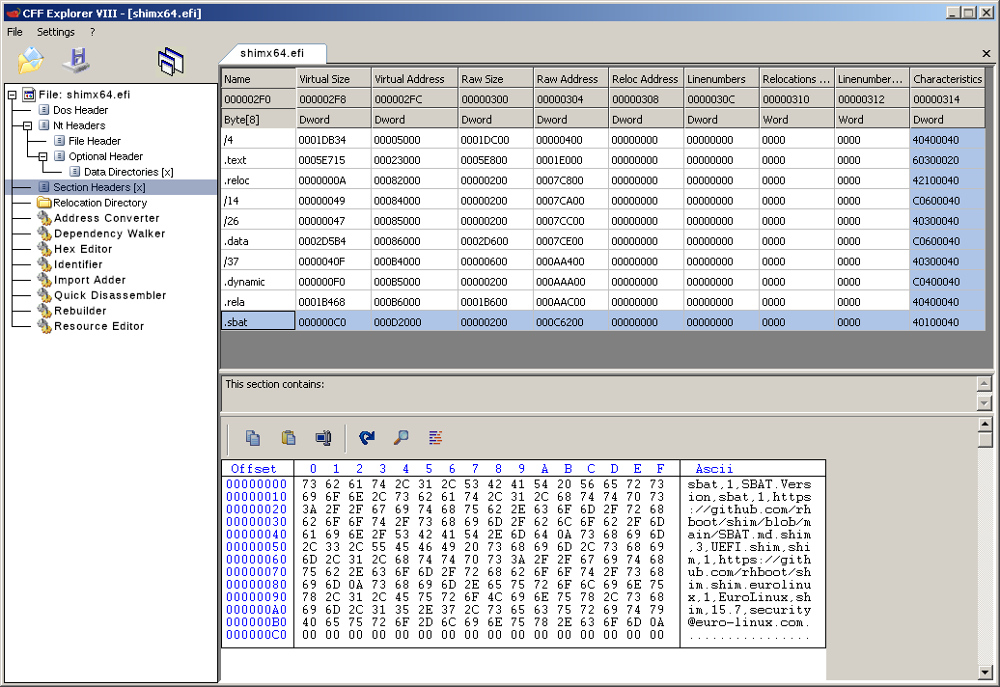

This repo is for review of requests for signing shim.  To create a request for review:

- clone this repo
- edit the template below
- add the shim.efi to be signed
- add build logs
- add any additional binaries/certificates/SHA256 hashes that may be needed
- commit all of that
- tag it with a tag of the form "myorg-shim-arch-YYYYMMDD"
- push that to github
- file an issue at https://github.com/rhboot/shim-review/issues with a link to your tag
- approval is ready when the "accepted" label is added to your issue

Note that we really only have experience with using GRUB2 on Linux, so asking
us to endorse anything else for signing is going to require some convincing on
your part.

Here's the template:

*******************************************************************************
### What organization or people are asking to have this signed?
*******************************************************************************

[EuroLinux Sp. z o.o.](https://en.euro-linux.com)

*******************************************************************************
### What product or service is this for?
*******************************************************************************
EuroLinux 9

*******************************************************************************
### What's the justification that this really does need to be signed for the whole world to be able to boot it?
*******************************************************************************
EuroLinux is an enterprise-class Linux operating system based on Red Hat
Enterprise Linux source code. It has been actively maintained since 2015.
EuroLinux is present in the top 50 on DistroWatch. EuroLinux Sp. z o.o. is
a company founded by people, who originally formed the Open Source market in
Central Europe.
Recently there has also been the release of EuroLinux 9 Desktop - a desktop spin of EuroLinux 9, which was well received by the technical sector.

*******************************************************************************
### Why are you unable to reuse shim from another distro that is already signed?
*******************************************************************************
Because we provide our own GRUB2 and kernel builds. Therefore we need to provide our own shim for the bootchain to be complete.

*******************************************************************************
### Who is the primary contact for security updates, etc.?
The security contacts need to be verified before the shim can be accepted. For subsequent requests, contact verification is only necessary if the security contacts or their PGP keys have changed since the last successful verification.

An authorized reviewer will initiate contact verification by sending each security contact a PGP-encrypted email containing random words.
You will be asked to post the contents of these mails in your `shim-review` issue to prove ownership of the email addresses and PGP keys.

*******************************************************************************
Both the contacts below have already been verified in the [version 8 review](https://github.com/rhboot/shim-review/issues/258).

- Name: [Jarosław Mazurkiewicz](https://github.com/jaromaz)
- Position: Senior DevOps Engineer
- Email address: jm@euro-linux.com
- [PGP key](pgp/jm.pub) fingerprint: B556 5E94 789A 8E43 318A  517B 0C83 B15E 33E3 1BCC

(Key should be signed by the other security contacts, pushed to a keyserver
like keyserver.ubuntu.com, and preferably have signatures that are reasonably
well known in the Linux community.)

*******************************************************************************
### Who is the secondary contact for security updates, etc.?
*******************************************************************************
- Name: [Kamil Aronowski](https://github.com/aronowski)
- Position: Security Engineer
- Email address: ka@euro-linux.com
- [PGP key](pgp/ka.pub) fingerprint: B761 A3E6 6292 3749 3C0A  6B4E FD76 C457 54FA DC09

(Key should be signed by the other security contacts, pushed to a keyserver
like keyserver.ubuntu.com, and preferably have signatures that are reasonably
well known in the Linux community.)

*******************************************************************************
### Were these binaries created from the 15.7 shim release tar?
Please create your shim binaries starting with the 15.7 shim release tar file: https://github.com/rhboot/shim/releases/download/15.7/shim-15.7.tar.bz2

This matches https://github.com/rhboot/shim/releases/tag/15.7 and contains the appropriate gnu-efi source.

*******************************************************************************
Yes, we are using the source from:
<https://github.com/rhboot/shim/releases/download/15.7/shim-15.7.tar.bz2>

*******************************************************************************
### URL for a repo that contains the exact code which was built to get this binary:
*******************************************************************************
https://github.com/rhboot/shim/releases/tag/15.7

SRPM based on 15.7 release tarball and RHEL package:

[shim-unsigned-x64-15.7-1.el9.src.rpm](shim-unsigned-x64-15.7-1.el9.src.rpm)

*******************************************************************************
### What patches are being applied and why:
*******************************************************************************
The ['Enable the NX compatibility flag by default'](https://github.com/rhboot/shim/pull/530) and [Make sbat_var.S parse right with buggy gcc/binutils](https://github.com/rhboot/shim/pull/535) patches have been ported and applied.

*******************************************************************************
### If shim is loading GRUB2 bootloader what exact implementation of Secureboot in GRUB2 do you have? (Either Upstream GRUB2 shim_lock verifier or Downstream RHEL/Fedora/Debian/Canonical-like implementation)
*******************************************************************************
Downstream RHEL-like implementation.

*******************************************************************************
### If shim is loading GRUB2 bootloader and your previously released shim booted a version of grub affected by any of the CVEs in the July 2020 grub2 CVE list, the March 2021 grub2 CVE list, the June 7th 2022 grub2 CVE list, or the November 15th 2022 list, have fixes for all these CVEs been applied?

* CVE-2020-14372
* CVE-2020-25632
* CVE-2020-25647
* CVE-2020-27749
* CVE-2020-27779
* CVE-2021-20225
* CVE-2021-20233
* CVE-2020-10713
* CVE-2020-14308
* CVE-2020-14309
* CVE-2020-14310
* CVE-2020-14311
* CVE-2020-15705
* CVE-2021-3418 (if you are shipping the shim_lock module)

* CVE-2021-3695
* CVE-2021-3696
* CVE-2021-3697
* CVE-2022-28733
* CVE-2022-28734
* CVE-2022-28735
* CVE-2022-28736
* CVE-2022-28737

* CVE-2022-2601
* CVE-2022-3775
*******************************************************************************
This is our first shim submission for EuroLinux 9.

*******************************************************************************
### If these fixes have been applied, have you set the global SBAT generation on your GRUB binary to 3?
*******************************************************************************
This is our first shim submission for EuroLinux 9.

*******************************************************************************
### Were old shims hashes provided to Microsoft for verification and to be added to future DBX updates?
### Does your new chain of trust disallow booting old GRUB2 builds affected by the CVEs?
*******************************************************************************
This is our first shim submission for EuroLinux 9.

*******************************************************************************
### If your boot chain of trust includes a Linux kernel:
### Is upstream commit [1957a85b0032a81e6482ca4aab883643b8dae06e "efi: Restrict efivar_ssdt_load when the kernel is locked down"](https://git.kernel.org/pub/scm/linux/kernel/git/torvalds/linux.git/commit/?id=1957a85b0032a81e6482ca4aab883643b8dae06e) applied?
### Is upstream commit [75b0cea7bf307f362057cc778efe89af4c615354 "ACPI: configfs: Disallow loading ACPI tables when locked down"](https://git.kernel.org/pub/scm/linux/kernel/git/torvalds/linux.git/commit/?id=75b0cea7bf307f362057cc778efe89af4c615354) applied?
### Is upstream commit [eadb2f47a3ced5c64b23b90fd2a3463f63726066 "lockdown: also lock down previous kgdb use"](https://git.kernel.org/pub/scm/linux/kernel/git/torvalds/linux.git/commit/?id=eadb2f47a3ced5c64b23b90fd2a3463f63726066) applied?
*******************************************************************************
The commits 1957a85b0032a81e6482ca4aab883643b8dae06e and 75b0cea7bf307f362057cc778efe89af4c615354 have been applied.

The commit eadb2f47a3ced5c64b23b90fd2a3463f63726066 has not been applied. However, EuroLinux kernel is built with the option `CONFIG_KDB_DEFAULT_ENABLE=0x0` so this commit is not required to solve any security issue. The appropriate config files are: [kernel-x86_64-rhel.config](assets/kernel-5.14.0-162.18.1.el9_1/kernel-x86_64-rhel.config) and [kernel-x86_64-debug-rhel.config](assets/kernel-5.14.0-162.18.1.el9_1/kernel-x86_64-debug-rhel.config):

```
$ grep CONFIG_KDB_DEFAULT_ENABLE *x86_64*.config
kernel-x86_64-debug-rhel.config:CONFIG_KDB_DEFAULT_ENABLE=0x0
kernel-x86_64-rhel.config:CONFIG_KDB_DEFAULT_ENABLE=0x0
```

*******************************************************************************
### Do you build your signed kernel with additional local patches? What do they do?
*******************************************************************************
There's the [nx-compat.patch](assets/kernel-5.14.0-162.18.1.el9_1/nx-compat.patch) which makes the `vmlinuz` PE binary have the `Image is NX compatible` DllCharacteristic according to the Microsoft requirements mentioned [here](https://github.com/rhboot/shim-review/issues/307):

> Also NX support needs to be added to bootloader **and kernel**.

*******************************************************************************
### If you use vendor_db functionality of providing multiple certificates and/or hashes please briefly describe your certificate setup.
### If there are allow-listed hashes please provide exact binaries for which hashes are created via file sharing service, available in public with anonymous access for verification.
*******************************************************************************
We don't use vendor_db functionality in this build.

*******************************************************************************
### If you are re-using a previously used (CA) certificate, you will need to add the hashes of the previous GRUB2 binaries exposed to the CVEs to vendor_dbx in shim in order to prevent GRUB2 from being able to chainload those older GRUB2 binaries. If you are changing to a new (CA) certificate, this does not apply.
### Please describe your strategy.
*******************************************************************************
This is our first submission for EuroLinux 9.

*******************************************************************************
### What OS and toolchain must we use to reproduce this build?  Include where to find it, etc.  We're going to try to reproduce your build as closely as possible to verify that it's really a build of the source tree you tell us it is, so these need to be fairly thorough. At the very least include the specific versions of gcc, binutils, and gnu-efi which were used, and where to find those binaries.
### If the shim binaries can't be reproduced using the provided Dockerfile, please explain why that's the case and what the differences would be.
*******************************************************************************
[Dockerfile](Dockerfile) to reproduce this build is included.

*******************************************************************************
### Which files in this repo are the logs for your build?
This should include logs for creating the buildroots, applying patches, doing the build, creating the archives, etc.
*******************************************************************************
[build.log](logs/build.log) and [root.log](logs/root.log).

*******************************************************************************
### What changes were made since your SHIM was last signed?
*******************************************************************************
This is our first submission for EuroLinux 9.

*******************************************************************************
### What is the SHA256 hash of your final SHIM binary?
*******************************************************************************
c1c4b58a3cd11df0fa9af88ea13591dee6525362d100ab4846e7a3a798afaa5b

*******************************************************************************
### How do you manage and protect the keys used in your SHIM?
*******************************************************************************
The keys are stored on a FIPS 140-2 certified HSM. Access to machine used to sign binaries is restricted physically. Only 2 trusted individuals have access to it.

*******************************************************************************
### Do you use EV certificates as embedded certificates in the SHIM?
*******************************************************************************
No.

*******************************************************************************
### Do you add a vendor-specific SBAT entry to the SBAT section in each binary that supports SBAT metadata ( grub2, fwupd, fwupdate, shim + all child shim binaries )?
### Please provide exact SBAT entries for all SBAT binaries you are booting or planning to boot directly through shim.
### Where your code is only slightly modified from an upstream vendor's, please also preserve their SBAT entries to simplify revocation.
*******************************************************************************
`shim`

```
sbat,1,SBAT Version,sbat,1,https://github.com/rhboot/shim/blob/main/SBAT.md
shim,3,UEFI shim,shim,1,https://github.com/rhboot/shim
shim.eurolinux,1,EuroLinux,shim,15.7,security@euro-linux.com
```

`grub2`

```
sbat,1,SBAT Version,sbat,1,https://github.com/rhboot/shim/blob/main/SBAT.md
grub,3,Free Software Foundation,grub,2.06,https//www.gnu.org/software/grub/
grub.rh,2,Red Hat,grub2,2.06-46.el9_1.3,mailto:secalert@redhat.com
grub.eurolinux,1,EuroLinux,grub2,2.06-46.el9_1.3,mailto:security@euro-linux.com
```

`fwupd`

```
sbat,1,UEFI shim,sbat,1,https://github.com/rhboot/shim/blob/main/SBAT.md
fwupd-efi,1,Firmware update daemon,fwupd-efi,1.3,https://github.com/fwupd/fwupd-efi
fwupd-efi.eurolinux,1,EuroLinux,fwupd,1.7.9,mail:security@euro-linux.com
```

*******************************************************************************
### Which modules are built into your signed grub image?
*******************************************************************************
```
all_video boot blscfg
cat configfile cryptodisk
echo ext2 f2fs fat font
gcry_rijndael gcry_rsa gcry_serpent
gcry_sha256 gcry_twofish gcry_whirlpool
gfxmenu gfxterm gzio
halt http increment iso9660
jpeg loadenv loopback linux lvm luks
luks2 mdraid09 mdraid1x minicmd net
normal part_apple part_msdos part_gpt
password_pbkdf2 pgp png reboot regexp
search search_fs_uuid search_fs_file
search_label serial sleep syslinuxcfg
test tftp version video xfs zstd
```

*******************************************************************************
### What is the origin and full version number of your bootloader (GRUB or other)?
*******************************************************************************
Same version as RHEL - with RHEL patches, our certs and SBAT data: `grub2-2.06-46.el9_1.3`.

*******************************************************************************
### If your SHIM launches any other components, please provide further details on what is launched.
*******************************************************************************
It also launches fwupd.

*******************************************************************************
### If your GRUB2 launches any other binaries that are not the Linux kernel in SecureBoot mode, please provide further details on what is launched and how it enforces Secureboot lockdown.
*******************************************************************************
GRUB2 is only used to load Linux kernel.

*******************************************************************************
### How do the launched components prevent execution of unauthenticated code?
*******************************************************************************
GRUB2 verifies signatures on booted kernels via shim. fwupd does not include code to launch other binaries, it can only load UEFI updates.

*******************************************************************************
### Does your SHIM load any loaders that support loading unsigned kernels (e.g. GRUB)?
*******************************************************************************
No - our shim loads only fwupd and the GRUB2 version that only supports loading signed kernels.

*******************************************************************************
### What kernel are you using? Which patches does it includes to enforce Secure Boot?
*******************************************************************************
RHEL version of Linux kernel `kernel-5.14.0-162.18.1.el9_1`. RHEL patches only for Secure Boot support and (as mentioned earlier in this review) the [nx-compat.patch](assets/kernel-5.14.0-162.18.1.el9_1/nx-compat.patch) which makes the `vmlinuz` PE binary have the `Image is NX compatible` DllCharacteristic according to the Microsoft requirements mentioned [here](https://github.com/rhboot/shim-review/issues/307):

> Also NX support needs to be added to bootloader **and kernel**.

*******************************************************************************
### Add any additional information you think we may need to validate this shim.
*******************************************************************************
Security contacts have not changed since the [last review](https://github.com/rhboot/shim-review/issues/258)

Our shim binary meets the three [UEFI CA memory mitigation requirements that Microsoft provided](https://techcommunity.microsoft.com/t5/hardware-dev-center/new-uefi-ca-memory-mitigation-requirements-for-signing/ba-p/3608714):

Two of them are:

> Section Alignment of the submitted PE file must be aligned with page size.  This must be 4kb, or a larger power of 2 (ex 64kb)
> DLL Characteristics must include IMAGE_DLLCHARACTERISTICS_NX_COMPAT 

The following listing proves these are met:

```
$ objdump -x shimx64.efi | grep -E 'SectionAlignment|DllCharacteristics'
SectionAlignment	00001000
DllCharacteristics	00000100
```

- (00001000)16 = (4096)10
- `./include/peimage.h:#define EFI_IMAGE_DLLCHARACTERISTICS_NX_COMPAT             0x0100`

There's also the third requirement:

> Section Flags must not combine `IMAGE_SCN_MEM_WRITE` and `IMAGE_SCN_MEM_EXECUTE` for any given section. 

So, according to [Microsoft documentation](https://learn.microsoft.com/en-us/windows/win32/api/winnt/ns-winnt-image_section_header), not even one Section Header may contain the sum: 0x20000000 + 0x80000000 in its Characteristics.

One can inspect the shim binary with various tools to see this requirement is also met as seen in the following screenshot:


